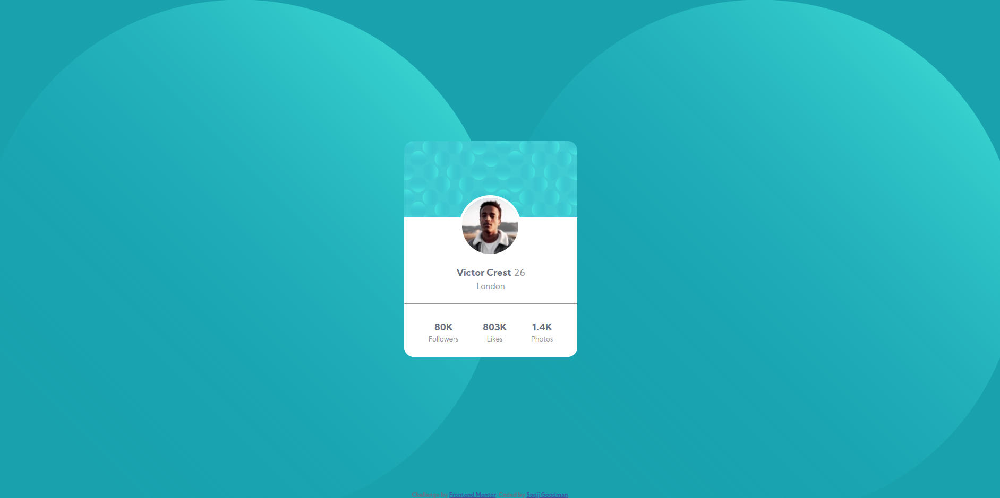
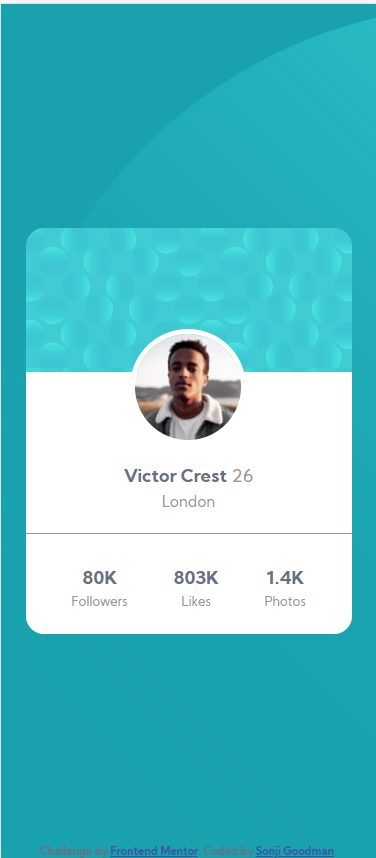

# Frontend Mentor - Profile card component solution

This is a solution to the [Profile card component challenge on Frontend Mentor](https://www.frontendmentor.io/challenges/profile-card-component-cfArpWshJ). Frontend Mentor challenges help you improve your coding skills by building realistic projects. 

## Table of contents

- [Frontend Mentor - Profile card component solution](#frontend-mentor---profile-card-component-solution)
  - [Table of contents](#table-of-contents)
  - [Overview](#overview)
    - [The challenge](#the-challenge)
    - [Screenshot](#screenshot)
    - [Links](#links)
  - [My process](#my-process)
    - [Built with](#built-with)
    - [What I learned](#what-i-learned)
    - [Continued development](#continued-development)
    - [Useful resources](#useful-resources)
  - [Author](#author)

## Overview

### The challenge

- Build out the project to the designs provided

### Screenshot

**DESKTOP:**

 

**MOBILE:**

### Links

- Solution URL: [Add solution URL here](https://your-solution-url.com)
- Live Site URL: [Add live site URL here](https://your-live-site-url.com)

## My process

### Built with

- Semantic HTML5 markup
- CSS
- Flexbox

### What I learned

I just learnt a bit more about flexbox via the Scrimba learning platform, so this was a good chance to put some of what I learnt into practice!

### Continued development

The biggest sticking point for me was trying to figure out how to position the image properly. I've read a bit about the  `position` property in the past, but I've never practiced at length with it, so I'm still a bit shaky on it. I would very much like to work on more projects where I can use this!

Also, I really like using Flexbox

### Useful resources

- [CSS Layout - The position Property](https://www.w3schools.com/css/css_positioning.asp) - This helped me understand a bit more about the `position` property
- [Scrimba](https://scrimba.com/) - I'm currently enrolled in their [Frontend Developer Career Path Bootcamp](https://scrimba.com/learn/frontend) and have learnt a great deal. They have other interesting courses I'd like to take afterwards (**Learn CSS Animations** sounds fun!)

## Author

- Frontend Mentor - [@Infinity-Mineevae](https://www.frontendmentor.io/profile/Infinity-Mineeva)

